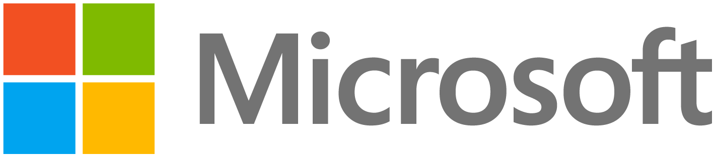

  

CS Unplugged is a collection of free teaching material that teaches Computer Science through engaging games and puzzles that use cards, string, crayons and lots of running around.

[Production website](https://www.csunplugged.org/) | [Development website](https://cs-unplugged-dev.csse.canterbury.ac.nz)
:-: | :-:
`master` branch | `develop` branch
 | 

## Documentation

Documentation for this project can be found on
[ReadTheDocs](https://cs-unplugged.readthedocs.io/),
and can also
be built from the documentation source within the `docs/` directory.

## Contributing

We would love your help to make this resource the best it can be!
Please read our
[contribution guide](https://cs-unplugged.readthedocs.io/getting_started/contributing_guide.html)
to get started.

## Licence

The content of this project itself is licensed under the
[Creative Commons Attribution-ShareAlike 4.0 International (CC BY-SA 4.0) licence](https://creativecommons.org/licenses/by-sa/4.0/)
(`LICENCE-CONTENT` file).
This licence applies to the following contents of this project:

- Markdown files located within the `csunplugged/topics/content/` directory.
- Images located within the `csunplugged/static/img/` directory.

Third-party libraries used in this project have their licences
listed within the `LICENCE-THIRD-PARTY` file, with a full copy of the licence
available within the `third-party-licences` directory.
If a source file of a third-party library or system is stored within this
repository, then a copyright notice should be present at the top of the file.

The rest of the project, which is the underlying source code used to manage
and display this content, is licensed under the
[MIT licence](https://opensource.org/licenses/MIT) (`LICENSE` file).

## Sponsors

A massive thank you to the following companies for supporting this project:

  
   
   
   
  
   
   
   
  
   
   
   
  

