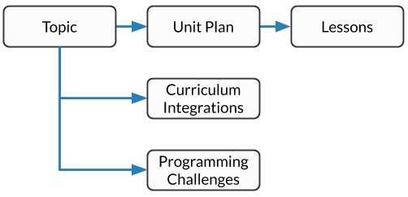
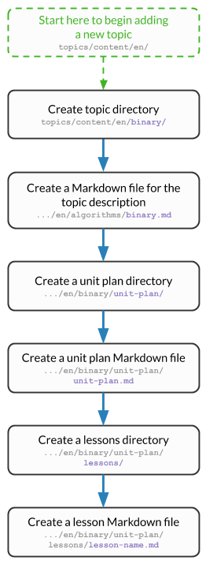

Topic Content
##############################################################################

The topics application (see :ref:`what-is-an-application`) is the main focus of
the CS Unplugged website, as it contains the majority of educational material
for the project.

.. contents:: Contents
  :local:

Topics Overview
==============================================================================

The following diagram shows the general structure of the topics application.

.. The following image can copied for be edits here: https://goo.gl/Vjv6XV

- The application is made up of **topics**.

  - A **topic** must contain at least one **unit plan**.

    - A **unit plan** must contain at least one **lesson**.

      - A **lesson** can contain **learning outcomes**, and
        **generated resources**.

  - A **topic** can also contain **curriculum integrations**.

    - A **curriculum integration** can also contain **curriculum areas**.

  - A **topic** can also contain **programming challenges**.

    - A **programming challenge** can use different **programming languages**, and be set at
      a specific **difficulty**.

- **Programming challenges**, **learning outcomes**, **curriculum areas**, and
  **glossary definitions**, are defined at a language level (e.g. English or German,
  not programming language), so can be used by all topics within that language directory.

This is a broad overview of the topics application, and the following sections provide more details.

Viewing All Topics Content
------------------------------------------------------------------------------

When developing locally, once you have run ``./dev start`` and ``./dev update`` (see
:doc:`../getting_started/helper_commands`) you can go to the url below to see your
local version of the website:

.. code-block:: none

  cs-unplugged.localhost/

.. _topics-directory-structure:

Topics Content Directory
==============================================================================

The ``content`` directory for the topics application contains:

- A directory for each language in which content exists, named using the Django
  locale code. These language directories each contain:

  - A folder for each Topic, containing the content Markdown files.
  - YAML files containing strings that need to be translated in each different language folder.

- A ``structure`` directory which contains all configuration YAML files.

- Several auto-generated directories. Please ignore these.

.. _file-types:

Content Files
==============================================================================

There are 3 different types of files used for adding content to CS Unplugged:

- Content Markdown files
- YAML files containing translatable strings
- YAML configuration files

All of these files live inside the ``topics/content`` directory.
The first two types of files are unique for each language, and are stored in a
directory tree specific to that language.
This directory is named using the languages Django locale code eg. ``en``, ``de_AT``.
The YAML configuration files are shared amongst all languages, because the content structure
is the same for all languages.
These files live under a special ``structure`` directory.

As a simple rule, structure files situated inside the ``structure`` directory
contain **no** text a website user will see.
Any user facing text lives in either a Markdown file or a YAML translation file
inside the locale specific directories.

.. _adding-topics-content:

Adding Content
==============================================================================

.. note ::
  If you are adding content for a language other than english then wherever the directory
  path ``topics/content/en/`` is used, replace ``en/`` with the relevant folder for that
  language, e.g. ``de/``

The following flow charts will take you step by step through the process of adding new
content to the topics application. Below this section are full details on how to structure
and write the configuration files for the topics application.
These charts and descriptions will use "Binary" as an example topic.

.. _adding-a-topic:

Adding a Topic
------------------------------------------------------------------------------

To set up a new topic, which you can then add content to, you will first need to:

- Create a set of required directories and Markdown files within the ``topics/content/en/``
  directory (replace ``en/`` if you are creating content for a different language, e.g. ``de/``).
- Add the required headings to these files.
- Create a set of required directories and config files within the ``topics/structure/`` directory.
- Add the minimum required configuration settings to these files.

Before you can run ``./dev update`` and view the topic on your local machine, these Markdown
and YAML files must contain some required headings and content. We recommend adding some
placeholder content to these files and checking that you can view them locally, before moving
on to adding content.

After these steps have been completed you can run ``./dev update``, and view
the topic at:

.. code-block:: none

  cs-unplugged.localhost/en/topics/

To create the required directories and Markdown files follow this flow chart:

.. The following image can copied for be edits here: https://goo.gl/Vjv6XV

Add the following content to these Markdown files:

- An H1 heading (i.e. has a single ``#`` prefix) and some placeholder text to the **topic** description Markdown file.

  - For example, add ``# Binary`` to the top of the file and the placeholder text ``test`` underneath this.

- An H1 heading and placeholder text to the **unit-plan** Markdown file.

- An H1 heading and placeholder text to the **lesson** Markdown file.

To create the required directories and config files follow this flow chart:

.. The following image can copied for be edits here: https://goo.gl/Vjv6XV
.. The image is included as raw HTML because it has clickable nodes.
.. raw:: html

  <map name="topic-structure-files-map">
    <area shape="rect" coords="236,230,312,264" href="#topic-configuration-file">
    <area shape="rect" coords="236,435,312,468" href="#unit-plan-configuration-file">
    <area shape="rect" coords="236,633,312,668" href="#adding-a-lesson">
  </map>
  

Add the required fields, and their keys, to these YAML files:

- The **topic** config file. The required fields are listed in the :ref:`topic-file` section.

- The **unit-plan** config file. The required fields are listed in the :ref:`unit-plan-file` section.

- The **lesson** config file. The required fields are listed in the section :ref:`lesson-file` section.

Now you can run the ``./dev update`` command.
Once this has finished you will be able to view the topic at ``cs-unplugged.localhost/en/topics/``

The description of the topic is written in the **topic** Markdown file.
This file:

- **Is in:** the topic directory, e.g. the description file for
  Binary will be in ``topics/content/en/binary/``.
- **Is called:** ``<topic-key>.md`` where ``<topic-key>`` is the key
  (:ref:`what-is-a-key`) of the topic and the name of the directory it is in,
  e.g. ``binary.md`` or ``kidbots.md``.
- **Contains:** an H1 heading (i.e. has a single ``#`` prefix)  and the content
  of the description.

.. note ::

  The heading written in this file will be used exactly as it is given
  throughout the website as the name of the topic.

.. warning::

  Every topic needs at least one unit plan, therefore the system will not allow
  a topic to be loaded until a unit plan is connected to it.

.. _adding-a-unit-plan:

Adding a Unit Plan
------------------------------------------------------------------------------

.. The following image can copied for be edits here: https://goo.gl/Vjv6XV
.. The image is included as raw HTML because it has clickable nodes.
.. raw:: html

  <map name="unit-plan-map">
    <area shape="rect" coords="233,410,309,445" href="#unit-plan-configuration-file">
    <area shape="rect" coords="233,616,309,650" href="#topic-configuration-file">
    <area shape="rect" coords="233,823,309,857" href="#unit-plan-configuration-file">
    <area shape="rect" coords="233,928,309,962" href="#adding-a-lesson">
    <area shape="rect" coords="233,1034,309,1068" href="../getting_started/helper_commands.html#update">
  </map>
  

The Markdown file containing the content of the unit plan:

- **Is in:** the unit plan directory, e.g. the unit plan file for Binary
  Unit Plan 2 will be in ``topics/content/en/binary/unit-plan-2/``.
- **Is called:** ``<unit-plan-key>.md`` where ``<unit-plan-key>`` is the key
  (:ref:`what-is-a-key`) of the unit plan and the name of the directory it is
  in, e.g. ``unit-plan-2.md``.
- **Contains:** an H1 heading (i.e. has a single ``#`` prefix) and the content
  of the unit plan.

.. note::

  The heading written in this file will be used exactly as it is given
  throughout the website as the name of the unit plan.

.. warning::

  Every unit plan needs at least one lesson, so the system will not allow a
  unit plan to be loaded until a lesson is connected to it.

.. _adding-a-lesson:

Adding a Lesson
------------------------------------------------------------------------------

.. The following image can copied for be edits here: https://goo.gl/Vjv6XV
.. The image is included as raw HTML because it has clickable nodes.
.. raw:: html

  <map name="lesson-map">
    <area shape="rect" coords="238,322,315,354" href="#lesson-configuration-file">
    <area shape="rect" coords="238,534,315,569" href="#unit-plan-configuration-file">
    <area shape="rect" coords="238,824,315,856" href="#lesson-configuration-file">
    <area shape="rect" coords="238,919,315,951" href="../getting_started/helper_commands.html#update">

    <area shape="rect" coords="595,322,670,354" href="#lesson-configuration-file">
    <area shape="rect" coords="595,534,670,569" href="#unit-plan-configuration-file">
    <area shape="rect" coords="595,632,670,666" href="#lesson-configuration-file">
    <area shape="rect" coords="595,728,670,760" href="../getting_started/helper_commands.html#update">
  </map>
  

The Markdown file containing the content for the lesson:

- **Is in:** the lesson subdirectory in the unit plan directory, e.g.
  ``topics/content/en/binary/unit-plan/lessons/``.
- **Is called:** ``<lesson-key>.md`` where ``<lesson-key>`` is the key
  (:ref:`what-is-a-key`) of the lesson, e.g. ``introduction-to-binary.md``.
- **Contains:** an H1 heading (i.e. has a single ``#`` prefix) and the content
  for the lesson.

.. note::

  The heading written in this file will be used exactly as it is given
  throughout the website as the name of the lesson.

.. note::

  If a lesson includes programming challenges, Computational Thinking links,
  and/or learning outcomes, then the corresponding configuration and content
  files may also need to be added or updated.

.. _adding-learning-outcomes:

Adding Learning Outcomes
------------------------------------------------------------------------------

There are two types of YAML files for Learning Outcomes.
One is in ``topics/structure`` and is shared by all language folders.
The other is the translation YAML file, which is unique to a language and is in
``topics/content/<language>`` (e.g. ``content/en``)

There should only be one ``learning-outcomes.yaml`` file per language directory.
If one already exists in the language directory then add new learning outcomes to this,
rather than creating a new file.

.. The following image can copied for be edits here: https://goo.gl/Vjv6XV
.. The image is included as raw HTML because it has clickable nodes.
.. raw:: html

  <map name="learning-outcomes-map">
    <area shape="rect" coords="240,100,317,135" href="#learning-outcomes-configuration-file">
    <area shape="rect" coords="240,210,317,245" href="#application-structure-configuration-file">
    <area shape="rect" coords="551,200,633,225" href="#learning-outcomes-configuration-file">
    <area shape="rect" coords="240,330,317,362" href="../getting_started/helper_commands.html#update">
  </map>
  

The translation YAML file containing learning outcomes descriptions:

- **Is in:** ``topics/content/en``
- **Is called:** ``learning-outcomes.yaml``
- **Contains:** Descriptions of all learning outcomes. Every learning outcome
  key present in the `Learning Outcomes Configuration File`_ must be present in
  the English translation file.

  For example,

  .. code-block:: yaml

    binary-convert-decimal:
      text: Perform a demonstration of how the binary number system works by converting any decimal number into a binary number.
    binary-justify-zeros-and-ones:
      text: Justify why there aren’t actual 0’s and 1’s zooming around inside a computer.
    binary-argue-zeros-and-ones-stored:
      text: Argue that 0’s and 1’s are still a correct way to explain what is stored in the computer.

You will now be able to add learning outcomes to lessons and programming
challenges by referencing the keys you specified in the learning outcomes configuration
file.

.. note::

  If a learning outcome contains curriculum areas, then the curriculum areas
  configuration file may also need to be added or updated.

.. _adding-curriculum-areas:

Adding Curriculum Areas
------------------------------------------------------------------------------

There should only be one ``curriculum-areas.yaml`` file per language directory.
If one already exists in the language directory then add new curriculum areas to this,
rather than creating a new file.

.. The following image can copied for be edits here: https://goo.gl/Vjv6XV
.. The image is included as raw HTML because it has clickable nodes.
.. raw:: html

  <map name="curriculum-areas-map">
    <area shape="rect" coords="230,236,305,270" href="#curriculum-areas-configuration-file">
    <area shape="rect" coords="230,362,305,396" href="#application-structure-configuration-file">
    <area shape="rect" coords="230,618,305,650" href="#curriculum-areas-configuration-file">
    <area shape="rect" coords="230,722,305,756" href="../getting_started/helper_commands.html#update">
  </map>
  

The translation YAML file containing curriculum areas descriptions:

- **Is in:** ``topics/content/en``
- **Is called:** ``curriculum-areas.yaml``
- **Contains:** Descriptions of all curriculum areas. Every curriculum area
  key present in the `Curriculum Areas Configuration File`_ must be present in
  the English translation file.

  For example,

  .. code-block:: yaml

    computational-thinking:
      name: Computational Thinking
    algorithmic-thinking:
      name: Algorithmic Thinking
    decomposition:
      name: Decomposition

You will now be able to add curriculum areas to learning outcomes and curriculum
integrations by referencing the keys you specified in the curriculum areas
configuration file.
Only curriculum areas without any children can be added to items.

.. _adding-a-programming-challenge:

Adding a Programming Challenge
------------------------------------------------------------------------------

There should only be one ``.yaml`` file per language directory.
If one already exists in the language directory then add new programming challenges to this,
rather than creating a new file.

.. The following image can copied for be edits here: https://goo.gl/Vjv6XV
.. The image is included as raw HTML because it has clickable nodes.
.. raw:: html

  <map name="programming-challenges-map">
    <area shape="rect" coords="554,470,633,505" href="#programming-challenges-configuration-file">
    <area shape="rect" coords="240,572,317,605" href="#programming-challenges-configuration-file">
    <area shape="rect" coords="240,694,317,727" href="#topic-configuration-file">
    <area shape="rect" coords="240,833,317,867" href="#programming-challenges-structure-configuration-file">
    <area shape="rect" coords="240,995,317,1030" href="../getting_started/helper_commands.html#update">
  </map>
  

You will now be able to add programming challenges to lessons by referencing the
keys you specified in the programming challenges configuration file.

A programming challenge is split into several different sections, each of which
is an its own Markdown file, all of which are in
``topics/content/en/binary/programming-challenges/<challenge-key>/``
where ``<challenge-key>`` refers to the key (:ref:`what-is-a-key`) of the
challenge, e.g. ``count-to-16``.

    1. The challenge description:

      - **Is called:** ``<challenge-key>.md`` where ``<challenge-key>`` is the key
        of the challenge, e.g. ``count-to-16.md``.
      - **Contains:** an H1 heading (i.e. has a single ``#`` prefix) and the content
        of the challenge.

      .. note::

        The heading written in this file will be used exactly as it is given
        throughout the website as the name of the programming challenge.

    2. The expected output

      - **Is called:** ``<language>-expected.md`` where ``<language>`` is the key
        of the programming language, e.g. ``python-expected.md``.
      - **Contains:** The expected output for the programming challenge, e.g. an
        embedded Scratch program or Python output.

    3. Hints (optional)

      - **Is called:** ``<language>-hints.md`` where ``<language>`` is the key
        of the programming language, e.g. ``scratch-hints.md``.
      - **Contains:** Hints for how to complete the challenge, e.g. suggested
        Scratch blocks.

    4. Example solution(s)

      - **Is called:** ``<language>-solution.md`` where ``<language>`` is the key
        of the programming language, e.g. ``ruby-solution.md``.
      - **Contains:** Example solutions to the challenge, e.g. Scratch program.

    5. Extra challenge(s) (optional)

      - **Is called:** the value defined in the programming challenges
        configuration file.
        A common filename is ``extra-challenge.md``.
      - **Contains:** Content for an extra challenge.

2-4 from the list above can be given in multiple programming languages.
Therefore, the languages you have chosen must be specified in the
``programming-challenges.yaml`` configuration file, as well as the
``programming-challenges-structure.yaml`` configuration file.

.. note::

  If the challenge includes learning outcomes, then the corresponding configuration
  file will also need to be added or updated to include new learning outcomes.

.. _adding-a-curriculum-integration:

Adding a Curriculum Integration
------------------------------------------------------------------------------

There should only be one ``.yaml`` file per language directory.
If one already exists in the language directory then add new curriculum integrations to this,
rather than creating a new file.

.. The following image can copied for be edits here: https://goo.gl/Vjv6XV
.. The image is included as raw HTML because it has clickable nodes.
.. raw:: html

  <map name="curriculum-integrations-map">
    <area shape="rect" coords="568,350,645,385" href="#curriculum-integrations-configuration-file">
    <area shape="rect" coords="240,450,317,485" href="#curriculum-integrations-configuration-file">
    <area shape="rect" coords="240,565,317,600" href="#topic-configuration-file">
    <area shape="rect" coords="240,675,317,710" href="../getting_started/helper_commands.html#update">
  </map>
  

The Markdown file containing the content of the curriculum integration:

- **Is in:** the curriculum integration directrory, e.g. curriculum integrations
  in Binary will be in
  ``topics/content/en/binary/curriculum-integrations/``.
- **Is called:** ``<integration-key>.md`` where ``<integration-key>`` is the key
  (:ref:`what-is-a-key`) of the curriculum integration, e.g. ``whose-cake-is-it.md``.
- **Contains:** an H1 heading (i.e. has a single ``#`` prefix) and the content
  of the integration.

.. note ::

  If the integration includes curriculum areas and/or prerequisite lessons,
  then the corresponding configuration and content files will also need to be added.

.. _adding-glossary-definitions:

Adding Glossary Definitions
------------------------------------------------------------------------------

There should only be one ``glossary`` directory per language directory.
If one already exists in the language directory then add new definitions to this,
rather than creating a new directory.

.. The following image can copied for be edits here: https://goo.gl/Vjv6XV
.. The image is included as raw HTML because it has clickable nodes.
.. raw:: html

  <map name="glossary-definitions-map">
    <area shape="rect" coords="240,200,317,230" href="#application-structure-configuration-file">
    <area shape="rect" coords="240,408,320,442" href="#glossary-definitions-markdown-file">
    <area shape="rect" coords="240,518,319,552" href="../getting_started/helper_commands.html#update">
  </map>
  

.. _glossary-definitions-markdown-file:

Each glossary definition requires a Markdown file within the glossary
folder, with the filename as the glossary key.
When linking text to a glossary definition, the key is used as the identifier.
For example, with the key ``pixel``, then a file ``pixel.md`` is
expected.

Each Markdown file should start with a heading containing the glossary term
(this should be capitalized and include any required punctuation), followed
by the term's definition.

Continuing the ``pixel.md`` example from above, this could be the possible
contents of that file.

.. code-block:: none

    # Pixel

    This term is an abbreviation of picture element, the name given to the
    tiny squares that make up a grid that is used to represent images on a
    computer.

.. _adding-classroom-resources:

Adding a Classroom Resource
------------------------------------------------------------------------------

There should only be one ``classroom-resources.yaml`` file per language directory.
If one already exists in the language directory then add new resources to this,
rather than creating a new file.

.. The following image can copied for be edits here: https://goo.gl/Vjv6XV
.. The image is included as raw HTML because it has clickable nodes.
.. raw:: html

  <map name="classroom-resources-map">
    <area shape="rect" coords="230,236,305,270" href="#classroom-resources-configuration-file">
    <area shape="rect" coords="230,362,305,396" href="#application-structure-configuration-file">
    <area shape="rect" coords="230,618,305,650" href="#classroom-resources-configuration-file">
    <area shape="rect" coords="230,722,305,756" href="../getting_started/helper_commands.html#update">
  </map>
  

The translation YAML file containing classroom resource descriptions:

- **Is in:** ``topics/content/en``
- **Is called:** ``classroom-resources.yaml``
- **Contains:** Descriptions of all classroom resources. Every classroom resource
  key present in the `Classroom Resources Configuration File`_ must be present in
  the English translation file.
  Descriptions must be short (less than 100 characters), as this list is displayed on the lesson sidebar.
  If a longer description is required, this should be within the lesson text within a panel.

  For example,

  .. code-block:: yaml

    pens:
      description:  Pens
    paper:
      description:  Paper
    number-line-0-20:
      description:  Number line from 0 to 20

Adding an Age Group
------------------------------------------------------------------------------

There should only be one ``age-groups.yaml`` file per language directory.
If one already exists in the language directory then add new age groups to this,
rather than creating a new file.

.. The following image can copied for be edits here: https://goo.gl/Vjv6XV
.. The image is included as raw HTML because it has clickable nodes.
.. raw:: html

  <map name="age-groups-map">
    <area shape="rect" coords="230,236,305,270" href="#age-group-configuration-file">
    <area shape="rect" coords="230,362,305,396" href="#application-structure-configuration-file">
    <area shape="rect" coords="230,618,305,650" href="#age-group-configuration-file">
    <area shape="rect" coords="230,722,305,756" href="../getting_started/helper_commands.html#update">
  </map>
  

The translation YAML file containing age group descriptions:

- **Is in:** ``topics/content/en``
- **Is called:** ``age-groups.yaml``
- **Contains:** Optional descriptions of programming challenge defined in the
  `Age Group Configuration File`_ .

  For example,

  .. code-block:: yaml

    5-7:
      description: Description of the 5-7 age group.

Adding a Programming Challenge Difficulty
------------------------------------------------------------------------------

There should only be one ``programming-challenges-structure-difficulties.yaml`` file per language directory.
If one already exists in the language directory then add new difficulties to this,
rather than creating a new file.

.. The following image can copied for be edits here: https://goo.gl/Vjv6XV
.. The image is included as raw HTML because it has clickable nodes.
.. raw:: html

  <map name="programming-challenge-difficulty-map">
    <area shape="rect" coords="238,258,312,292" href="#application-structure-configuration-file">
    <area shape="rect" coords="238,563,312,597" href="#programming-challenges-structure-file">
    <area shape="rect" coords="238,680,312,712" href="../getting_started/helper_commands.html#update">
  </map>
  

The translation YAML file containing difficulty descriptions:

- **Is in:** ``topics/content/en``
- **Is called:** ``programming-challenges-structure-difficulties.yaml``
- **Contains:** Descriptions of difficulties defined in the `Programming Challenges Structure Configuration File`_.
  Every difficulty key present in the configuration file must also be present in
  the English YAML translation file.

  For example,

  .. code-block:: yaml

    difficulty-0:
      name: Try it out
    difficulty-1:
      name: Beginner
    difficulty-2:
      name: Growing experience

Adding Programming Challenge Languages
------------------------------------------------------------------------------

There should only be one ``programming-challenges-structure-languages.yaml`` file per language directory.
If one already exists in the language directory then add new languages to this,
rather than creating a new file.

.. The following image can copied for be edits here: https://goo.gl/Vjv6XV
.. The image is included as raw HTML because it has clickable nodes.
.. raw:: html

  <map name="programming-challenge-language-map">
    <area shape="rect" coords="238,258,312,292" href="#application-structure-configuration-file">
    <area shape="rect" coords="238,563,312,597" href="#programming-challenges-structure-file">
    <area shape="rect" coords="238,680,312,712" href="../getting_started/helper_commands.html#update">
  </map>
  

The translation YAML file containing programming language descriptions:

- **Is in:** ``topics/content/en``
- **Is called:** ``programming-challenges-structure-languages.yaml``
- **Contains:** Names of languages defined in the `Programming Challenges Structure Configuration File`_.
  Every language key present in the configuration file must also be present in the English YAML translation file.

  For example,

  .. code-block:: yaml

    scratch:
      name: Scratch
    python:
      name: Python

Configuration Files
==============================================================================

This section details configuration files within the ``content/structure`` directory.
These files are in YAML format. If you are not familiar with YAML, see
:doc:`understanding_configuration_files`.

The diagram below shows an example of YAML file locations for the
``content/structure/`` language directory, where:

- Blue is directories.
- Red is YAML configuration files.

.. raw:: html
  :file: ../_static/html_snippets/topics_content_directory_tree_only_yaml.html

In the following sections, each configuration file is explained in more detail.

.. note::

  - Some of the keys (:ref:`what-is-a-key`) have angle brackets around them,
    ``<like so>``. This means that they are variables and you can call them
    whatever you like in your configuration file (without the angle brackets).

.. _application-structure-file:

Application Structure Configuration File
------------------------------------------------------------------------------

- **File Name:** ``structure.yaml``

- **Location:** ``topics/content/structure/``

- **Purpose:** Defines the top level configuration files to process for defining
  the content of the topics application.

- **Required Fields:**

  - ``topics:`` A list of file paths to topic configuration files.

- **Optional Fields:**

    - ``age-groups:`` The path to the age group configuration file.
    - ``classroom-resources:`` The path to the classroom resources configuration file.
    - ``curriculum-areas:`` The path to the curriculum areas configuration file.
    - ``glossary-folder:`` The folder name that contains the Markdown files for
      glossary definitions.
    - ``learning-outcomes:`` The path to the learning outcomes configuration file.
    - ``programming-challenges-structure:`` The path to the programming exercises structure
      configuration file.

A complete application structure file may look like the following:

.. code-block:: yaml

  topics:
    - binary-numbers
    - error-detection-correction

  age-groups: age-groups.yaml
  learning-outcomes: learning-outcomes.yaml
  curriculum-areas: curriculum-areas.yaml
  programming-challenges-structure: programming-challenges-structure.yaml

  glossary-folder: glossary

.. _topic-file:

Topic Configuration File
------------------------------------------------------------------------------

- **File Name:** ``<topic-key>.yaml``

- **Location:** ``topic/content/structure/<topic-key>/``

- **Referenced In:** ``topic/content/structure/structure.yaml``

- **Purpose:** This file defines the attributes of a specific topic, including connected
  unit plan, programming challenge, and curriculum integration configuration files.

- **Required Fields:**

  - ``unit-plans:`` A list of keys, where each key is a unit plan.

- **Optional Fields:**

  - ``icon:`` An image file to be used as the icon for the topic.

  - ``other-resources:`` A Markdown file containing information about other related
    (external) resources.

  - ``programming-challenges:`` The path to the programming challenges configuration file.

  - ``curriculum-integrations:`` The path to the curriculum integrations configuration
    file.

A complete topic structure file may look like the following:

.. code-block:: yaml

  unit-plans:
    - unit-plan
    - unit-plan-2

  icon: img/binary-numbers-0-1.png

  other-resources: other-resources.md

  programming-challenges: programming-challenges/programming-challenges.yaml
  curriculum-integrations: curriculum-integrations/curriculum-integrations.yaml

.. _unit-plan-file:

Unit Plan Configuration File
------------------------------------------------------------------------------

- **File Name:** ``<unit-plan-key>.yaml``

- **Location:** ``topic/content/structure/<topic-key>/<unit-plan-key>/``

- **Referenced In:** ``topic/content/structure/<topic-key>/<topic-key>.yaml``

- **Purpose:** This file defines which lessons to use in each age group

  - **Required Fields:**

    - ``lessons:`` The path to the lessons configuration file.

    - ``age-groups:`` Keys of age groups and their corresponding lessons.

      - **Required Fields:**

        - ``<age-group>:`` The key for the age group.

          - **Required Fields:**

            - ``<lesson-key>`` The key for a lesson.

              - **Required Fields:**

                - ``number`` The number order for this lesson, relative
                  to this age group.
                  This value allows a lesson to be used in different age
                  groups, as different numbered lessons (e.g. lesson 2 for
                  5 to 7, but lesson 1 for 8 to 10).

  - **Optional Fields:**

    - ``computational-thinking-links:`` The Markdown filename containing
        Computational Thinking links.

A complete unit plan structure file with multiple lessons may look like the
following:

.. code-block:: yaml

  lessons: lessons/lessons.yaml

  age-groups:
    5-7:
      what-is-binary-junior:
        number: 1
      how-binary-digits-work:
        number: 2
    8-10:
      how-binary-digits-work:
        number: 1
      reinforcing-sequencing-in-binary-number-systems:
        number: 2
      codes-for-letters-using-binary-representation:
        number: 3

.. _lesson-file:

Lesson Configuration File
------------------------------------------------------------------------------

- **File Name:** ``<lessons>.yaml``

- **Location:** ``topic/content/structure/<topic-key>/<unit-plan-key>/lessons/``

- **Referenced In:** ``topic/content/structure/<topic-key>/<unit-plan-key>/<unit-plan-key>.yaml``

- **Purpose:** This file defines all the lessons (and their respective
  attributes) for the specific unit plan.

  - **Required Fields:**

    - ``<lesson-key>:`` This is the key for the lesson. Each lesson has its own list of
      required and optional fields:

      - **Optional Fields:**

        - ``duration``: The estimated time to complete the lesson (in minutes).

        - ``computational-thinking-links``: The Markdown filename containing
          Computational Thinking links.

        - ``programming-challenges:`` A list of keys corresponding to programming
          challenges.

        - ``programming-challenges-description``: The Markdown filename
          containing a description for the programming challenges.

        - ``learning-outcomes:`` A list of keys corresponding to learning outcomes.

        - ``classroom-resources:`` A list of keys corresponding to classroom resources.

        - ``generated-resources:`` A list of keys of generated CSU resources connected to this
          lesson.

A complete lesson structure file with multiple lessons may look like the
following:

.. code-block:: yaml

  introduction-to-bits:
    programming-challenges:
      - count-to-16
      - count-to-1-million
    learning-outcomes:
      - binary-data-representation
    generated-resources:
      - sorting-network
    classroom-resources:
      - pens
      - paper
      - dice

  how-binary-digits-work:
    computational-thinking-links: how-binary-digits-work-ct-links.md
    learning-outcomes:
      - binary-data-representation
      - binary-justify-representation

.. _age-groups-file:

Age Group Configuration File
------------------------------------------------------------------------------

- **File Name:** ``age-groups.yaml``

- **Location:** ``topics/content/structure/``

- **Referenced In:** ``topics/content/structure/structure.yaml``

- **Purpose:** Defines the age groups available for all lessons.

- **Required Fields:**

  - ``<age-group-key>:`` This is the key for the age group.
    Each age group has its own list of required and optional fields:

    - **Required Fields:**

      - ``min_age:`` The minimum age of the age group.
      - ``max_age:`` The maximum age of the age group.

A complete age group structure file may look like the following:

.. code-block:: yaml

  5-7:
      min_age: 5
      max_age: 7
  8-10:
      min_age: 8
      max_age: 10
  11-14:
      min_age: 11
      max_age: 14

Age group descriptions can then be set by creating a YAML translation file ``topics/content/en/age-groups.yaml``.

For example,

.. code-block:: yaml

  5-7:
    description: Description of the 5-7 age group.

.. _learning-outcomes-file:

Learning Outcomes Configuration File
------------------------------------------------------------------------------

- **File Name:** ``learning-outcomes.yaml``

- **Location:** ``topics/content/structure/``

- **Referenced In:** ``topics/content/structure/structure.yaml``

- **Purpose:** Defines the learning outcomes available for all topics.

- **Required Fields:**

  - ``<learning-outcome-key>:`` This is the key for the learning outcome.
    Each learning outcome has its own list of required and optional fields:

    - **Optional Fields:**

      - ``curriculum-areas:`` A list of curriculum area keys (see example file below).
        Each curriculum area listed must not contain child curriculum areas.

A complete learning outcome structure file may look like the following:

.. code-block:: yaml

  no-physical-zeros-ones:
    curriculum-areas:
      - computational-thinking

  binary-correct-representation:
    curriculum-areas:
      - computational-thinking
      - data-representation

  maths-comparing-numbers:
    curriculum-areas:
      - numeracy

.. _curriculum-areas-file:

Curriculum Areas Configuration File
------------------------------------------------------------------------------

- **File Name:** ``curriculum-areas.yaml``

- **Location:** ``topics/content/structure/``

- **Referenced In:** ``topics/content/structure/structure.yaml``

- **Purpose:** Defines the curriculum areas available for all topics.

- **Required Fields:**

  - ``<curriculum-area-name>:`` This is the key for the curriculum area. Each curriculum
    area has its own list of required and optional fields:

    - **Required Fields:**

      - ``number:`` A number used for ordering curriculum areas.
        Areas are sorted in ascending numbers (smallest to largest).
      - ``colour:`` The CSS colour class to use for colouring the curriculum
        area badge on the website.
        This colour is also applied to all children of curriculum area.

        Available colours include:

        - ``blue``
        - ``green``
        - ``light-purple``
        - ``orange``
        - ``pink``
        - ``purple``
        - ``red``
        - ``teal``
        - ``yellow``

        These colours are defined in: ``csunplugged/static/scss/website.scss``.

    - **Optional Fields:**

      - ``children:`` A list of sub-curriculum areas (see example file below).
        Children inherit the same colour and number as their parent.

An example curriculum areas file with multiple curriculums may look like
the following:

.. code-block:: yaml

  maths:
    colour: green
    children:
      - geometry
      - algebra

  science:
    colour: blue

  art:
    colour: teal

.. note::

  The maximum depth for children is one, that is, children curriculum areas
  cannot have children.

.. note::

  When including a curriculum area in another configuration file, only
  curriculum areas with no children can be listed.
  This is because it can be confusing when items belong to the parent
  curriculum area but not any child in particular.
  Therefore each item must be linked to a curriculum area with no children.
  Parent curriculum areas (areas with children) are used in search forms to
  select all child curriculum areas and their related items.

.. _programming-challenges-structure-file:

Programming Challenges Structure Configuration File
------------------------------------------------------------------------------

- **File Name:** ``programming-challenges-structure.yaml``

- **Location:** ``topics/content/structure/``

- **Referenced In:** ``topics/content/structure/structure.yaml``

- **Purpose:** This file defines the structure of programming challenges for all
  topics.

- **Required Fields:**

  - ``languages:`` A list of languages that programming challenges can be given in.

    - **Required Fields:**

      - ``<language-name>:`` This is the key for the language. Each language has its own
        list of required and optional fields:

        - **Required Fields:**

          - ``number:`` A number used for ordering programming languages.
            Languages are sorted in ascending numbers (smallest to largest).

        - **Optional Fields:**

          - ``icon:`` An image file to be used as the icon for the language.

  - ``difficulties:`` A list of difficulty keys programming challenges can be labelled with, from easiest to hardest.

.. warning::

  Due to technical limitations, the programming challenge difficulty keys must not be purely numeric.
  For example, the key ``difficulty-1`` is valid, but the key ``1`` is not.

A complete programming challenge structure file may look like the following:

.. code-block:: yaml

  language:
    scratch:
      number: 1
      icon: img/scratch-cat.png
    ruby:
      number: 2

  difficulties:
    - difficulty-1
    - difficulty-2
    - difficulty-3

.. _programming-challenges-file:

Programming Challenges Configuration File
------------------------------------------------------------------------------

- **File Name:** ``programming-challenges.yaml``

- **Location:** ``topics/content/structure/<topic-key>/programming-challenges/``

- **Referenced In:** ``topics/content/structure/<topic-key>/<topic-key>.yaml``

- **Purpose:** This file defines the programming challenges (and their respective attributes)
  for a particular topic.

- **Required Fields:**

  - ``<programming-challenge-name>``

    - **Required Fields:**

      - ``challenge-set-number:`` The group of related programming challenges this
        challenge belongs to (see note below).

      - ``challenge-number:`` The number order for this programming challenge (see note below).

      - ``difficulty-level:`` A key corresponding to a difficulty level.

      - ``programming-languages:`` A list of keys corresponding to programming languages
        that this challenge is given in.

    - **Optional Fields:**

      - ``learning-outcomes:`` A list of keys corresponding to learning outcomes.

      - ``extra-challenge:`` A Markdown filename containing the content for an
        extra challenge.

.. note ::

  Programming challenges are sorted by their ``challenge-set-number``
  and then their ``challenge-number``.
  These numbers are not directly displayed, but used to calculate a
  programming challenge's number for a lesson.

  For example, if a lesson lists the following challenges:

  - Challenge A: 1.1
  - Challenge B: 1.3
  - Challenge C: 2.2
  - Challenge D: 9.3

  The lesson will display these challenges as:

  - Challenge A: 1.1
  - Challenge B: 1.2
  - Challenge C: 2.1
  - Challenge D: 3.1

A complete programming challenges structure file may look like the following:

.. code-block:: yaml

  count-to-16:
    challenge-set-number: 1
    challenge-number: 1
    difficulty-level: 1
    programming-languages:
      - ruby
      - python
    learning-outcomes:
      - programming-sequence

  count-to-a-million:
    challenge-set-number: 1
    challenge-number: 2
    difficulty-level: 3
    programming-languages:
      - python
    learning-outcomes:
      - programming-basic-logic
    extra-challenge: extra-challenge.md

.. _curriculum-integrations-file:

Curriculum Integrations Configuration File
------------------------------------------------------------------------------

- **File Name:** ``curriculum-intergrations.yaml``

- **Location:** ``topics/content/structure/<topic-key>/curriculum-integrations/``

- **Referenced In:** ``topics/content/structure/<topic-key>.yaml``

- **Purpose:** Contains a list of curriculum integrations that can be used to integrate
  the topic with another area in the curriculum.

- **Required Fields:**

  - ``<curriculum-integration>:`` This is the key for the curriculum integration. Each
    curriculum integration has its own list of required and optional fields:

    - **Required Fields:**

      - ``number:`` The number order for this curriculum integration. Curriculum
        integrations are sorted by this number.

      - ``curriculum-areas:`` A list of keys corresponding to other curriculum areas
        that this curriculum integration could be used in.
        Each curriculum area listed must not contain child curriculum areas.

    - **Optional Fields:**

      - ``prerequisite-lessons:`` A list of lesson slugs that are
        expected to be completed before attempting this curriculum integration.

            - **Required Fields:**

              - ``<lesson-key>`` A key corresponding to a lesson in the given unit
                plan.

A complete curriculum integration structure file with multiple curriculum integrations
may look like the following:

.. code-block:: yaml

  binary-number-bracelets:
    number: 1
    curriculum-areas:
      - math
      - art
    prerequisite-lessons:
      unit-plan:
        - introduction-to-binary-digits
      unit-plan-2:
        - counting-in-binary

  binary-leap-frog:
    number: 2
    curriculum-areas:
      - math
      - pe
    prerequisite-lessons:
      unit-plan-2:
        - counting-in-binary

.. _classroom-resources-file:

Classroom Resources Configuration File
------------------------------------------------------------------------------

- **File Name:** ``classroom-resources.yaml``

- **Location:** ``topics/content/structure/``

- **Referenced In:** ``topics/content/structure/<topic-key>/<unit-plan-key>/lessons/lessons.yaml``

- **Purpose:** Defines the classroom resources available for all topics.

- **Required Fields:**

  - ``classroom-resources:`` List of available classroom resource keys

A complete classroom resources structure file may look like the following:

.. code-block:: yaml

  classroom-resources:
    - pens
    - paper
    - number-line-0-20
    - musical-instruments
    - alphabet-cards
    - parity-cards-set
    - whiteboard
    - whiteboard-pens
    - product-barcodes
    - payment-system
    - pencils
    - stopwatch
    - handheld-whiteboards
    - clipboards
    - blocks
    - hula-hoop
    - counters
    - chalk
    - colouring-pens
