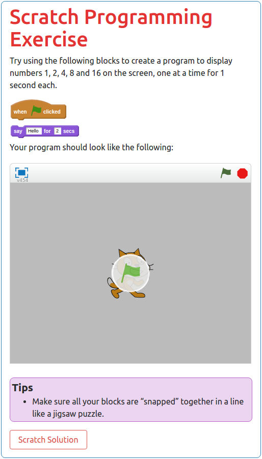

Writing Guide
##############################################################################

The majority of our text content is written in Markdown, and we also developed
a program called `Verto`_ to allow you to include HTML elements like images and
videos with simple text tags.

For example, the following text:

.. code-block:: none

  # Scratch Programming Challenge

  Try using the following blocks to create a program to display numbers 1, 2,
  4, 8 and 16 on the screen, one at a time.


  ```scratch
  when flag clicked

  say [Hello] for [2] secs
  ```

  Your program should look like the following:

  {iframe link="http://scratch.mit.edu/projects/embed/148423714/?autostart=false"}

  {panel type="note}
  # Tips
  
  - Make sure all your blocks are “snapped” together in a line like a
    jigsaw puzzle.

  {panel end}

  {button-link link="challenge/scratch-solution.html" text="Scratch Solution"}

will display as the following on the website:



.. note::

  If you already know Markdown syntax, please remember the following project
  preferences (for consistency and readability):

  - Use asterisks (``*``) for emphasis, instead of underscores.
  - Use hyphens (``-``) for unordered lists.
  - No HTML within text files, we use Verto text tags to add iframes,
    images, videos, etc.

Below is a basic guide to syntax for Markdown and Verto text tags.
When viewing Verto documentation for a tag, the top of the page will detail
how to use the tag in a basic example.
Some text tags also have required and/or optional tag parameters for further
configuration.

.. contents:: Text Syntax
  :local:

------------------------------------------------------------------------------

Blockquotes
==============================================================================

.. code-block:: none

  > Blockquotes are very handy to emulate reply or output text.
  > This line is part of the same quote.

  Quote break.

  > Oh, you can *put* **Markdown** into a blockquote.

------------------------------------------------------------------------------

Boxed Text (Verto feature)
==============================================================================

`Click here to read the documentation on how to box text`_.

------------------------------------------------------------------------------

Code
==============================================================================

You are able to include code snippets, either in a line of text or as a new
block.

To include inline code, add a backtick to either side of the code.
For example: \`print("Hi")\` will display as ``print("Hi")``.
You cannot set the language syntax highlighting for inline code.

To create a code block, use a line of three backticks before and after the
code. You also can add syntax highlighting by specifying the language after
the first set of backticks (`list of language codes`_).

.. code-block:: none

  ```python3
  def find_high_score(scores):
      if len(scores) == 0:
          print("No high score, table is empty")
          return -1
      else:
          highest_so_far = scores[0]
          for score in scores[1:]:
              if score > highest_so_far:
                  highest_so_far = score
          return highest_so_far
  ```

.. code-block:: python3

  def find_high_score(scores):
      if len(scores) == 0:
          print("No high score, table is empty")
          return -1
      else:
          highest_so_far = scores[0]
          for score in scores[1:]:
              if score > highest_so_far:
                  highest_so_far = score
          return highest_so_far

------------------------------------------------------------------------------

Comment (Verto feature)
==============================================================================

`Click here to read the documentation on how to add a comment`_.

------------------------------------------------------------------------------

Conditional (Verto feature)
==============================================================================

`Click here to read the documentation on how to define a conditional`_.

------------------------------------------------------------------------------

Embed iframe (Verto feature)
==============================================================================

`Click here to read the documentation on how to embed with an iframe`_.

------------------------------------------------------------------------------

Emphasis
==============================================================================

.. code-block:: none

  Emphasis, aka italics, with *asterisks*.

  Strong emphasis, aka bold, with **asterisks**.

Emphasis, aka italics, with *asterisks*.

Strong emphasis, aka bold, with **asterisks**.

.. note::

  We do not use underscores for emphasis to maintain consistency and
  readability.

------------------------------------------------------------------------------

Glossary Link (Verto feature)
==============================================================================

`Click here to read the documentation on how to define a glossary link`_.

The list of defined glossary terms available for linking to can be found in the
:ref:`application-structure-file`.

------------------------------------------------------------------------------

Heading (Verto feature)
==============================================================================

`Click here to read the documentation on how to create a heading`_.

------------------------------------------------------------------------------

Image (Verto feature)
==============================================================================

`Click here to read the documentation on how to include an image`_.

------------------------------------------------------------------------------

Interactive (Verto feature)
==============================================================================

`Click here to read the documentation on how to include an interactive`_.

------------------------------------------------------------------------------

Line Breaks
==============================================================================

Here are some things to try out:

.. code-block:: none

  Here's a line for us to start with.

  This line is separated from the one above by two newlines, so it will be a
  *separate paragraph*.

  This line is also a separate paragraph, but...
  This line is only separated by a single newline, so it's a separate line
  in the *same paragraph*.

------------------------------------------------------------------------------

Links
==============================================================================

There are several links that may be used:

The general syntax for links is ``[link text](link url)`` where ``link text``
is the text to be displayed in the document, and ``link url`` is the
destination of the link.

**Escaping closing brackets within link URLs:** A closing bracket can be
escaped by prefixing it with a backslash ``\)``.

Link to page within website
------------------------------------------------------------------------------

.. note::

  This type of link requires knowledge of project URL routing, required URL
  values, and the `Django URL template tag <https://docs.djangoproject.com/en/1.11/ref/templates/builtins/#url>`__.
  If you are unsure on how to create a link of this type, please contact us
  and we will be happy to help.

Links to pages within the website use the Django ``url`` template tag.
In order to create a link, use the values that would be given to the template tag.
See the example below for an example.

This following Markdown:

.. code-block:: none

  See [challenge 4.1]('topics:programming_challenge' 'kidbots' 'check-if-divisor').

results in the following HTML:

.. code-block:: html

  See <a href="/en/topics/kidbots/programming/check-if-divisor">challenge 4.1</a>.

Currently linking to a heading within the page is not supported (or recommended
as heading text can change easily).

Link to resource page with pre-selected options
------------------------------------------------------------------------------

.. note::

  This type of link requires knowledge of project URL routing, required URL
  values, and the `Django URL template tag <https://docs.djangoproject.com/en/1.11/ref/templates/builtins/#url>`__.
  If you are unsure on how to create a link of this type, please contact us
  and we will be happy to help.

This link uses the same syntax as internal links, with a query string appended
at the end.
The Markdown processor Verto will read the link string and seperate everything
before and after the ``?`` symbol, and will create a link using the Django URL tag
with everything before the symbol (the same way a normal internal link is created).
Then the processor will append the query string at the end of the link (see
example below).
Each parameter should be a resource option with its desired value.
Values given as query parameters override the default values for each resource.

This following Markdown:

.. code-block:: none

  [Little Red Riding Hood cards]('resources:resource' 'sorting-network-cards'?type=riding_hood)

results in the following HTML to the Django system:

.. code-block:: html

  <a href="?type=riding_hood">Little Red Riding Hood cards</a>

results in the following HTML to the user:

.. code-block:: html

  <a href="/en/resources/sorting-network-cards/?type=riding_hood">Little Red Riding Hood cards</a>

Link to a page outside of website (external link)
------------------------------------------------------------------------------

These are links to websites that are not a part of the CS Unplugged project.
The URL should include the ``https://`` or ``http://`` as required.

.. code-block:: none

  Check out [Google's website](https://www.google.com).

Create a link on an image (Verto feature)
------------------------------------------------------------------------------

Images should now be linked using the ``caption-link`` and ``source`` tag
parameters for including an image.

Create a link on a button (Verto feature)
------------------------------------------------------------------------------

`Click here to read the documentation on how to add a button link`_.

------------------------------------------------------------------------------

Lists
==============================================================================

Lists can be created by starting each line with a ``-`` for unordered lists
or ``1.`` for ordered lists.
The list needs to be followed by a blank line, however it doesn't require a
blank line before unless the preceding text is a heading (a blank line is
then required).
If you are having issues with a list not rendering correctly, try adding a
blank line before the list if there is none, otherwise `submit a bug report`_
if you are still having rendering issues.

.. code-block:: none

  Unordered list:
  - Item 1
  - Item 2
  - Item 3

  Ordered list:
  1. Item 1
  2. Item 2
  3. Item 3

Unordered list:

- Item 1
- Item 2
- Item 3

Ordered list:

1. Item 1
2. Item 2
3. Item 3

Nested lists can be created by indenting each level by 2 spaces.

.. code-block:: none

  1. Item 1
    1. A corollary to the above item, indented by 2 spaces.
    2. Yet another point to consider.
  2. Item 2
    * A corollary that does not need to be ordered.
      * This is indented four spaces, because it's two for each level.
      * You might want to consider making a new list by now.
  3. Item 3

1. Item 1

  1. A corollary to the above item, indented by 2 spaces.
  2. Yet another point to consider.

2. Item 2

  * A corollary that does not need to be ordered.

    * This is indented four spaces, because it's two for each level.
    * You might want to consider making a new list by now.

3. Item 3

------------------------------------------------------------------------------

Math
==============================================================================

To include math (either inline or as a block) use the following syntax while
using LaTeX syntax.

.. code-block:: none

  This is inline math: ``\( 2 + 2 = 4 \)``

  This is block math:

  ``\[ \begin{bmatrix} s & 0 \\ 0 & s \\ \end{bmatrix} \]``

Math equations are rendered in MathJax using the LaTeX syntax.

------------------------------------------------------------------------------

Panel (Verto feature)
==============================================================================

`Click here to read the documentation on how to create a panel`_.

Supported panel types
---------------------

These are the panel types that have built in styling for CS Unplugged.
Other panel types are supported, but will not have any special styling.
Have a play around with them to see how they look!


- ct-algorithm
- ct-abstraction
- ct-decomposition
- ct-pattern
- ct-logic
- ct-evaluation
- video

------------------------------------------------------------------------------

Scratch (Verto feature)
==============================================================================

`Click here to read the documentation on how to include an image of Scratch block`_.

------------------------------------------------------------------------------

Table of Contents (Verto feature)
==============================================================================

`Click here to read the documentation on how to include a table of contents`_.

------------------------------------------------------------------------------

Tables
==============================================================================

Tables can be created using the following syntax:

.. code-block:: none

  Colons can be used to align columns.

  | Tables        | Are           | Cool  |
  | ------------- |:-------------:| -----:|
  | col 3 is      | right-aligned | $1600 |
  | col 2 is      | centered      |   $12 |
  | zebra stripes | are neat      |    $1 |

.. raw:: html
  :file: ../_static/html_snippets/markdown_example_table.html

The outer pipes (|) are optional, and you don't need to make the raw Markdown
line up prettily, but there must be at least 3 dashes separating each header
cell.
You can also use inline Markdown.

.. code-block:: none

  Markdown | Less | Pretty
  --- | --- | ---
  *Still* | `renders` | **nicely**
  1 | 2 | 3

.. raw:: html
  :file: ../_static/html_snippets/markdown_example_table_2.html

------------------------------------------------------------------------------

Video (Verto feature)
==============================================================================

`Click here to read the documentation on how to include a video`_.

------------------------------------------------------------------------------

.. _Verto: http://verto.readthedocs.io/en/latest/
.. _submit a bug report: https://github.com/uccser/cs-unplugged/issues/new
.. _Click here to read the documentation on how to box text: http://verto.readthedocs.io/en/latest/processors/boxed-text.html
.. _list of language codes: https://haisum.github.io/2014/11/07/jekyll-pygments-supported-highlighters/
.. _Click here to read the documentation on how to add a comment: http://verto.readthedocs.io/en/latest/processors/comment.html
.. _Click here to read the documentation on how to define a conditional: http://verto.readthedocs.io/en/latest/processors/conditional.html
.. _Click here to read the documentation on how to embed with an iframe: http://verto.readthedocs.io/en/latest/processors/iframe.html
.. _Click here to read the documentation on how to define a glossary link: http://verto.readthedocs.io/en/latest/processors/glossary-link.html
.. _Click here to read the documentation on how to create a heading: http://verto.readthedocs.io/en/latest/processors/heading.html
.. _Click here to read the documentation on how to include an image: http://verto.readthedocs.io/en/latest/processors/image.html
.. _Click here to read the documentation on how to include an interactive: http://verto.readthedocs.io/en/latest/processors/interactive.html
.. _Click here to read the documentation on how to create a relative link: http://verto.readthedocs.io/en/latest/processors/relative-link.html
.. _Click here to read the documentation on how to add a button link: http://verto.readthedocs.io/en/latest/processors/button-link.html
.. _Click here to read the documentation on how to create a panel: http://verto.readthedocs.io/en/latest/processors/panel.html
.. _Click here to read the documentation on how to include an image of Scratch block: http://verto.readthedocs.io/en/latest/processors/scratch.html
.. _Click here to read the documentation on how to include a table of contents: http://verto.readthedocs.io/en/latest/processors/table-of-contents.html
.. _Click here to read the documentation on how to include a video: http://verto.readthedocs.io/en/latest/processors/video.html
