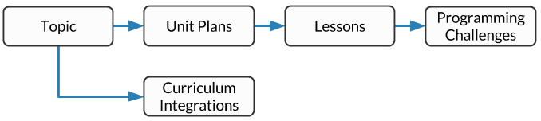
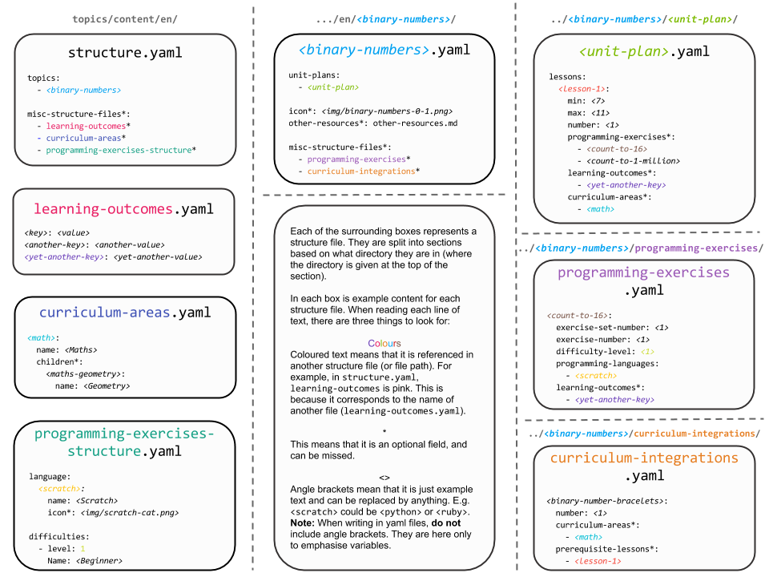

Topic Content
##############################################################################

The topics application (see :ref:`what-is-an-application`) is the main focus of
the CS Unplugged website, as it contains the majority of educational material
for the project.

.. contents:: Contents
  :local:

Topics Overview
==============================================================================

A general overview of the topics application can be described in the following
diagram.

.. The following image can copied for be edits here: https://goo.gl/Vjv6XV

- The application is made up of **topics**.

  - A **topic** must contain at least one **unit plan**.

    - A **unit plan** must contain at least one **lesson**.

      - A lesson can contain **learning outcomes**, **curriculum areas** and **generated
        resources**.

  - A **topic** can also contain **curriculum integrations**, which can also contain
    **curriculum areas**.

  - A **topic** can also contain **programming exercises**.

    - A **programming exercise** can use different **programming languages** and be set at
      different **difficulties**.

- **Learning outcomes**, **curriculum areas**, **programming languages** and
  **difficulties** are defined at a language level, so can be used by all topic content.

This is just a broad overview of the topics application.

.. _viewing-the-current-state:

Viewing the Current State
------------------------------------------------------------------------------

When developing locally, once you have a server and ``gulp`` running (see
:doc:`../getting_started/basic_usage`) you can go to the url below to get a
quick overview of what content is loaded:

.. code-block:: none

  localhost:3000/__dev__/

For more information about what this page displays, see :doc:`../developer/dev`.

.. _topics-directory-structure:

Topics Content Directory
==============================================================================

The diagram below is an example of the ``content/en/`` language directory for
the project's topic application, where:

- Blue is directories.
- Red is YAML configuration files (see :doc:`understanding_configuration_files`).
- Green is Markdown text files.

.. raw:: html
  :file: ../_static/html_snippets/topics_content_directory_tree.html

.. _adding-topics-content:

Adding Content
==============================================================================

The following flow charts will take you step by step through the process of
adding new content to the topics application, and you can click the 'Read more'
items on flowcharts to be taken to the relevant section in the documentation.
Below this section is full details on how to structure and write the
configuration files for the topics application.

.. _adding-topics-content-topic:

Adding a Topic
------------------------------------------------------------------------------

You can add a new topic by following this flowchart.

.. The following image can copied for be edits here: https://goo.gl/Vjv6XV
.. The image is included as raw HTML because it has clickable nodes.
.. raw:: html

  <map name="topics-map">
    <area shape="rect" coords="215,90,317,127" href="#topics-content-directory">
    <area shape="rect" coords="215,200,317,234" href="#topic-file">
    <area shape="rect" coords="215,307,317,343" href="#application-structure-file">
    <area shape="rect" coords="215,425,317,460" href="../getting_started/basic_usage.html#command-manage-updatedata">
    <area shape="rect" coords="215,541,317,576" href="../getting_started/basic_usage.html#command-manage-runserver">
    <area shape="rect" coords="215,658,317,694" href="../getting_started/basic_usage.html#command-gulp">
  </map>
  

After you have added a topic, you can then add unit plans, lessons, follow
up activities, and programming exercises using the flow charts below.

.. _adding-topics-content-unit-plan:

Adding a Unit Plan and/or Lesson
------------------------------------------------------------------------------

You can add a new unit plan and/or lesson by following this flowchart.
If a lesson requires new learning outcomes or curriculum areas, see
:ref:`adding-topics-content-learning-outcomes-curriculum-areas`.

.. The following image can copied for be edits here: https://goo.gl/Vjv6XV
.. The image is included as raw HTML because it has clickable nodes.
.. raw:: html

  <map name="unit-plan-map">
    <area shape="rect" coords="215,90,317,127" href="#topics-content-directory">
    <area shape="rect" coords="284,330,387,364" href="#topics-content-directory">
    <area shape="rect" coords="284,570,387,605" href="#unit-plan-file">
    <area shape="rect" coords="284,684,387,719" href="#topic-file">
    <area shape="rect" coords="284,930,387,965" href="#topics-content-directory">
    <area shape="rect" coords="284,1172,387,1206" href="#unit-plan-file">
    <area shape="rect" coords="284,1294,387,1329" href="#unit-plan-file">
    <area shape="rect" coords="229,1471,333,1504" href="../getting_started/basic_usage.html#command-manage-updatedata">
    <area shape="rect" coords="229,1589,333,1622" href="../getting_started/basic_usage.html#command-manage-runserver">
    <area shape="rect" coords="229,1704,333,1738" href="../getting_started/basic_usage.html#command-gulp">
  </map>
  

.. _adding-topics-content-curriculum-integrations:

Adding a Curriculum Integration
------------------------------------------------------------------------------

You can add a new curriculum integration by following this flowchart.
If a curriculum integration requires new curriculum areas, see
:ref:`adding-topics-content-learning-outcomes-curriculum-areas`.

.. The following image can copied for be edits here: https://goo.gl/Vjv6XV
.. The image is included as raw HTML because it has clickable nodes.
.. raw:: html

  <map name="curriculum-integrations-map">
  <area shape="rect" coords="217,90,319,127" href="#topics-content-directory">
  <area shape="rect" coords="283,459,387,494" href="#topics-content-directory">
  <area shape="rect" coords="283,571,387,607" href="#curriculum-integrations-file">
  <area shape="rect" coords="283,688,387,723" href="#topic-file">
  <area shape="rect" coords="283,939,387,973" href="#curriculum-integrations-file">
  <area shape="rect" coords="216,1088,319,1124" href="../getting_started/basic_usage.html#command-manage-updatedata">
  <area shape="rect" coords="216,1206,319,1240" href="../getting_started/basic_usage.html#command-manage-runserver">
  <area shape="rect" coords="216,1325,319,1358" href="../getting_started/basic_usage.html#command-gulp">
  </map>
  

.. _adding-topics-content-programming-exercise:

Adding a Programming Exercise
------------------------------------------------------------------------------

You can add a new programming exercise by following this flowchart.
If a programming exercise requires new learning outcomes, see
:ref:`adding-topics-content-learning-outcomes-curriculum-areas`.

.. The following image can copied for be edits here: https://goo.gl/Vjv6XV
.. The image is included as raw HTML because it has clickable nodes.
.. raw:: html

  <map name="programming-exercise-map">
    <area shape="rect" coords="215,90,320,126" href="#topics-content-directory">
    <area shape="rect" coords="284,460,387,494" href="#topics-content-directory">
    <area shape="rect" coords="284,571,387,607" href="#programming-exercises-file">
    <area shape="rect" coords="284,684,387,719" href="#topic-file">
    <area shape="rect" coords="284,805,387,841" href="#topics-content-directory">
    <area shape="rect" coords="284,1074,387,1110" href="#programming-exercises-file">
    <area shape="rect" coords="349,1542,452,1578" href="#programming-exercises-file">
    <area shape="rect" coords="216,1709,319,1744" href="../getting_started/basic_usage.html#command-manage-updatedata">
    <area shape="rect" coords="216,1826,319,1860" href="../getting_started/basic_usage.html#command-manage-runserver">
    <area shape="rect" coords="216,1943,319,1977" href="../getting_started/basic_usage.html#command-gulp">
  </map>
  

.. _adding-topics-content-learning-outcomes-curriculum-areas:

Adding Learning Outcomes and/or Curriculum Areas
------------------------------------------------------------------------------

You can add a new programming exercise by following this flowchart.

.. The following image can copied for be edits here: https://goo.gl/Vjv6XV
.. The image is included as raw HTML because it has clickable nodes.
.. raw:: html

  <map name="learning-outcomes-curriculum-areas-map">
    <area shape="rect" coords="215,90,320,126" href="#topics-content-directory">
    <area shape="rect" coords="281,342,387,377" href="#learning-outcomes-file">
    <area shape="rect" coords="281,616,387,652" href="#curriculum-areas-file">
  </map>
  

Configuration Files
==============================================================================

This section details configuration files within the ``content`` directory for a specific
language.
These files are in YAML format. If you are not familiar with YAML, see
:doc:`understanding_configuration_files`.

The diagram below shows an example of YAML file locations for the
``content/en/`` language directory, where:

- Blue is directories.
- Red is YAML configuration files.

.. raw:: html
  :file: ../_static/html_snippets/topics_content_directory_tree_only_yaml.html

The diagram below shows an overview of what is in each config file:

In the following sections, each configuration file is exaplained in more detail.

.. note::
  
  - We use the term "key" to specify a field name. Keys map to particular values (which
    range from learning outcome text, to the structure and attributes of a lesson).
    There are two things to remember with keys:

    - They must be written in lowercase and use hyphens instead of spaces.

    - They must be exact matches to work, for example, if you name a lesson
      ``bits-and-bytes``, referencing it in another configuration file as
      ``bytes-and-bits`` will raise an error.
    

.. note::

  - Some of the keys have angle brackets around them, ``<like so>``. This means that they
    are variables and you can call them whatever you like in your configuration file
    (without the angle brackets).

.. _application-structure-file:

Application Structure Configuration File
------------------------------------------------------------------------------

- **File Name:** ``structure.yaml``

- **Location:** ``topics/content/<language>/``

- **Purpose:** Defines the top level configuration files to process for defining
  the content of the topics application.

- **Required Fields:**

  - ``topics``: A list of keys, where each key is a topic name.

- **Optional Fields:**

  - ``misc-structure-files:`` A list of keys corresponding to configuration files to
    include. Each key corresponds to the name of another configuration file (and has its
    own description further down this page). The complete list of keys is given below:

    - ``learning-outcomes``
    - ``curriculum-areas``
    - ``programming-exercises-structure``

A complete application structure file may look like the following:

.. code-block:: yaml

  topics:
    - binary-numbers
    - error-detection-correction

  misc-structure-files:
    - learning-outcomes
    - curriculum-areas
    - programming-exercises-structure

.. _topic-file:

Topic Configuration File
------------------------------------------------------------------------------

- **File Name:** ``<topic-name>.yaml``

- **Location:** ``topic/content/<language>/<topic-name>/``

- **Referenced In:** ``topic/content/<launguage>/structure.yaml``

- **Purpose:** This file defines the attributes of a specific topic, including connected
  unit plan, programming exercise, and curriculum integration configuration files.

- **Required Fields:**

  - ``unit-plans:`` A list of keys, where each key is a unit plan.

- **Optional Fields:**

  - ``icon:`` An image file to be used as the icon for the topic.

  - ``other-resources:`` A Markdown file containing information about other related
    (external) resources.

  - ``misc-structure-files:`` A list of keys corresponding to configuration files to
    include for this particular topic. Each key corresponds to the name of another
    configuration file (and has its own description further down this page). The complete
    list of keys is given below:

    - ``programming-exercises``
  
    - ``curriculum-integrations``

A complete topic structure file may look like the following:

.. code-block:: yaml

  unit-plans:
    - unit-plan
    - unit-plan-2

  icon: img/binary-numbers-0-1.png

  other-resources: other-resources.md

  misc-structure-files:
    - programming-exercises
    - curriculum-integrations

.. _unit-plan-file:

Unit Plan Configuration File
------------------------------------------------------------------------------

- **File Name:** ``<unit-plan-name>.yaml``

- **Location:** ``topic/content/<language>/<topic-name>/<unit-plan-name>/``

- **Referenced In:** ``topic/content/<language>/<topic-name>/<topic-name>.yaml``

- **Purpose:** This file defines all the lessons (and their respective)
  attributes for the unit plan.

  - **Required Fields:**

    - ``<lesson-name>:`` This is the key for the lesson. Each lesson has its own list of
      required and optional fields:

      - **Required Fields:**

        - ``min-age:`` The suggested minimum age group to teach this lesson to.

        - ``max-age:`` The suggested maximum age group to teach this lesson to.

        - ``number:`` The number order for this lesson.
          Lessons are sorted by minimum age, maximum age, then number so lessons in
          different age ranges can use the same number without conflict.

      - **Optional Fields:**

        - ``duration``: The estimated time to complete the lesson (in minutes).

        - ``programming-exercises:`` A list of keys corresponding to programming
          exercises.

        - ``learning-outcomes:`` A list of keys corresponding to learning outcomes.

        - ``curriculum-areas:`` A list of keys corresponding to other curriculum areas
          that this lesson could be taught in.

        - ``generated-resources:`` A list of generated CSU resources connected to this
          lesson.

          - **Required Fields:**:

            - ``<resource>``: The key corresponding to the resource.

              - **Required Fields:**:

                - ``description:`` A description of how the resource should be used.

A complete unit plan structure file with multiple lessons may look like the
following:

.. code-block:: yaml
    
  introduction-to-bits:
    min-age: 7
    max-age: 11
    number: 1
    programming-exercises:
      - count-to-16
      - count-to-1-million
    learning-outcomes:
      - binary-data-representation
    curriculum-areas*:
      - maths
    generated-resources:
      sorting-network:
        description: One per student.

  how-binary-digits-work:
    min-age: 7
    max-age: 11
    number: 2
    learning-outcomes:
      - binary-data-representation
      - binary-justify-representation

.. _curriculum-integrations-file:

Curriculum Integrations Configuration File
------------------------------------------------------------------------------

- **File Name:** ``curriculum-intergrations.yaml``

- **Location:** ``topics/content/<language>/<topic-name>/``

- **Referenced In:** ``topics/content/<language>/<topic-name>.yaml``

- **Purpose:** Contains a list of activities that can be used to integrate the
  topic with another area in the curriculum.

- **Required Fields:**

  - ``<activity-name>:`` This is the key for the curriculum integration activity. Each
    activity has its own list of required and optional fields:

    - **Required Fields:**

      - ``number:`` The number order for this activity. Curriculum integration activities
        are sorted by this number.

    - **Optional Fields:**

      - ``curriculum-areas:`` A list of keys corresponding to other curriculum areas
        that this activity could be used in.

      - ``prerequisite-lessons:`` A list of keys corresponding to lessons that are
        expected to be completed before attemping this activity.

A complete curriculum integration structure file with multiple activities may
look like the following:

.. code-block:: yaml

  binary-number-bracelets:
    number: 1
    curriculum-areas:
      - math
      - art
    prerequisite-lessons:
      - introduction-to-binary-digits
      - counting-in-binary

  binary-leap-frog:
    number: 2
    curriculum-areas:
      - math
      - pe
    prerequisite-lessons:
      - counting-in-binary

.. _programming-exercises-structure-file:

Programming Exercises Structure Configuration File
------------------------------------------------------------------------------

- **File Name:** ``programming-exercises-structure.yaml``

- **Location:** ``topics/content/<language>/``

- **Referenced In:** ``topics/content/<language>/structure.yaml``

- **Purpose:** This file defines the structure of programming exercises for all
  topics.

- **Required Fields:**

  - ``languages:`` A list of languages that programming exercises can be given in.

    - **Required Fields:**

      - ``<language-name>:`` This is the key for the language. Each language has its own
        list of required and optional fields:

        - **Required Fields:**

          - ``name:`` The name of the programming language (this is what will be
            displayed to the user).

        - **Optional Fields:**

          - ``icon:`` An image file to be used as the icon for the language.

  - ``difficulties:`` A list of difficulties programming exercises can be labelled as.

    - **Required Fields:**

      - ``<level>:`` An integer value.

        - **Required Fields:**

        - ``name:`` The name of the difficulty level (this is what will be displayed to
          the user).

A complete programming exercise structure file may look like the following:

.. code-block:: yaml

  language:
    scratch:
      name: Scratch
      icon: img/scratch-cat.png
    ruby:
      name: Ruby

  difficulties:
    1:
      name: Beginner
    2:
      name: Intermediate
    3:
      name: Advanced

.. _programming-exercises-file:

Programming Exercises Configuration File
------------------------------------------------------------------------------

- **File Name:** ``programming-exercises.yaml``

- **Location:** ``topics/content/<language>/<topic-name>/programming-exercises/``

- **Referenced In:** ``topics/content/<language>/<topic-name>/<topic-name>.yaml``

- **Purpose:** This file defines the programming exercises (their respective attributes)
  for a particular topic.

- **Required Fields:**

  - ``<programming-exercise-name>``

    - **Required Fields:**

      - ``exercise-set-number:`` The group of related programming exercises this
        exercise belongs to.

      - ``exercise-number:`` The number order for this programming exercise.
        Exercises are sorted this number.

      - ``difficulty-level:`` A key corresponding to a difficulty level.

      - ``programming-languages:`` A list of keys corresponding to programming languages
        that this exercise is given in.

    - **Optional Fields:**

      - ``learning-outcomes:`` A list of keys corresponding to learning outcomes.

A complete programming exercises structure file may look like the following:

.. code-block:: yaml

  count-to-16:
    exercise-set-number: 1
    exercise-number: 1
    difficulty-level: 1
    programming-languages:
      - ruby
      - python
    learning-outcomes:
      - programming-sequence

  count-to-a-million:
    exercise-set-number: 1
    exercise-number: 2
    difficulty-level: 3
    programming-languages:
      - python
    learning-outcomes:
      - programming-basic-logic
    

.. _learning-outcomes-file:

Learning Outcomes Configuration File
------------------------------------------------------------------------------

- **File Name:** ``learning-outcomes.yaml``

- **Location:** ``topics/content/<language>/``

- **Referenced In:** ``topics/content/<language>/structure.yaml``

- **Purpose:** Defines the learning outcomes avilable for all topics.

- **Required Fields:**

  - ``<key> : <value>`` Key value pairs. The key will be used in other configuration
    files to reference this particluar learning objective. The value is the learning
    objective text that will be displayed to the user).

A complete learning outcome structure file may look like the following:

.. code-block:: yaml

  binary-data-representation: Explain how a binary digit is represented using two contrasting values.
  binary-count: Demonstrate how to represent any number between 0 and 31 using binary.
  binary-convert-decimal: Perform a demonstration of how the binary number system works by converting any decimal number into a binary number.
  binary-justify-representation: Argue that 0’s and 1’s are still a correct way to represent what is stored in the computer.

.. _curriculum-areas-file:

Curriculum Areas File
------------------------------------------------------------------------------

- **File Name:** ``curriculum-areas.yaml``

- **Location:** ``topics/content/<language>/``

- **Referenced In:** ``topics/content/<language>/structure.yaml``

- **Purpose:** Defines the curriculum areas available for all topics.

- **Required Fields:**

  - ``<curriculum-area-name>:`` This is the key for the curriculum area. Each curriculum
    area has its own list of required and optional fields:

    - **Required Fields:**

      - ``name:`` The name of the curriculum area (this is what will be displayed to the
        user).

    - **Optional Fields:**

      - ``children:`` A list of sub-curriculm areas (see example file below). Each child
        requires a name field.

An example curriculum areas file with multiple curriculums may look like
the following:

.. code-block:: yaml

  maths:
    name: Maths
    children:
      geometry:
        name: Geometry
      algebra:
        name: Algebra

  science:
    name: Science

  art:
    name: Art

.. note::

  The maximum depth for children is one, that is, children curriculum areas
  cannot have children.

.. note::

  When including a curriculum area in another configuration file, adding a child
  curriculum area will automatically add the parent curriculum area, you do not need to
  specify this manually. For example, adding "geometry" means that "maths" is
  automatically included.

