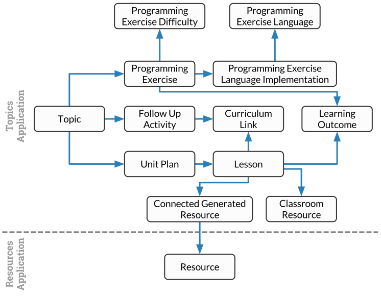

Django setup
##############################################################################

This page covers the configuration of Django for this project.

Database Structure
==============================================================================

The following image shows the relationships between models within the database.

.. The following image can copied for be edits here: https://goo.gl/kcycns

.. note::

  **Lesson** and **Programming Exercise Language Implementation** models have
  the parent's **Topic** saved directly within their model.
