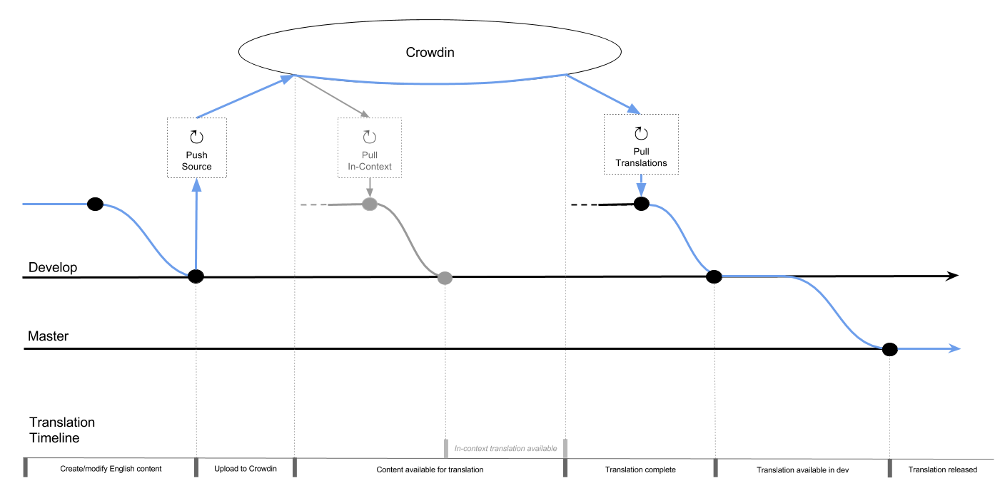

Translation Infrastructure
##############################################################################

Crowdin
==============================================================================
We use a localisation management platform called `Crowdin <https://crowdin.com/project/cs-unplugged>`_ for translation of CS Unplugged. The project is public, meaning that anyone can create an account and contribute translations.

Currently, the following languages are available for translation:

  - Hebrew
  - Maori
  - Polish

These languages serve as a test bed for internationalisation of CS Unplugged.
Further languages will be added over time once the developers are satisfied
that the translation pipeline is stable.

Files Configurations
==============================================================================
There are 3 types of files that contain translatable content:

- Content markdown files
- Content yaml files containg translatable model strings
- ``django.po`` file containing translatable system strings

Translatable source files must always reside under an ``en`` directory tree.
Translated files are downloaded into a directory named with the language's
locale code, and with the same structure as the source tree.

.. note::
  The locale code differs from the language code in format - where a language
  code is of form ``ab-cd``, the locale code will be ``ab_CD``. Directories must be named
  using the locale code recognised by django for that language.

  For more information, see

  - https://docs.djangoproject.com/en/1.11/topics/i18n/
  - https://github.com/django/django/tree/master/django/conf/locale
  - https://github.com/django/django/blob/master/django/utils/translation/trans_real.py#L59

The configuration specifying which files should be uploaded for translation is
stored in the file ``crowdin_content.yaml`` in the repository root. For details
about the structure of this file, see the `documentation <https://support.crowdin.com/configuration-file/>`_.

.. note::
  The crowdin placeholder ``osx_locale`` matches the django locale code
  in almost all cases, and should be used for every entry in the config file.
  You can view a list of the Crowdin language code values `here <https://api.crowdin.com/api/supported-languages>`_.
  In any cases where the osx_locale code does not match the django locale code,
  use a custom `language mapping <https://support.crowdin.com/configuration-file/#language-mapping>`_.

  Due to the various automated components in the translation pipeline, the
  following restrictions are imposed on the config file:

  - The ``%osx_locale%`` and ``%original_file_name%`` placeholders must be used.
  - No other placeholders may be used.
  - If a ``language_mapping`` is provided for ``osx_locale``, it must be the same for
    all ``files`` entries.

Review Process
==============================================================================
For a translation of any given string to make it to production release, it must
pass the following stages of review:

1. (Crowdin) Translation Proofread - Review by a second translator with 'proofreader' status in the target language.
2. (Crowdin) Tech Review - Review by a member of the CS Unplugged technical team to catch technical errors (i.e. with Verto tags, links, markdown syntax etc).
3. (GitHub) PR Review - Final review of completed translation files being merged into develop. Automated testing on travis will also occur at this stage.

The first two review phases are enforced by a `custom workflow <https://support.crowdin.com/advanced-workflows/>`_ on Crowdin.

In-Context Translation
==============================================================================
We utilise Crowdin's `in-context localisation <https://support.crowdin.com/in-context-localization/>`_ feature to allow content
translation directly on the website, by switching to a special Translation Mode pseudo-language.
In-context translation is only enabled on the `development version <http://cs-unplugged-dev.appspot.com>`_ of CS Unplugged.

.. note::
  The pseudo-language used on Crowdin is ``en-UD`` (English Upside-down)
  The translation mode language used in django is ``xx-lr``. A custom
  ``language_mapping`` entry in the configuration file is used to map from one to the other.

  Additionally, a bi-directional translation mode is available using the language ``yy-rl``.
  The directory trees for this language are always symlinks to ``xx-lr``, but the website is rendered using a RTL layout.
  This enables translators to see how their RTL translations will look when released.
  This language is not involved in the process of downloading translations from crowdin.

.. _inContextVertoCaveat:

.. note::

  Verto tags are treated like any other string on Crowdin. Because of this, the in-context pseudo-translation files have replaced verto tags with their crowdin identifiers (which then get substituted with the original/translated string on the front end).
  This is problematic, because tags need to be present when processed by Verto which occurs before the content gets to the front end.

  As a workaround, the following modifications are made to in-context pseudo translations of markdown files:

  - An XLIFF file is downloaded containing the source strings together with their identifiers.
  - All source strings in XLIFF file are matched against a regex for Verto block tags.
  - For every match:

    - The identifier in the markdown file is replaced by the source string (the verto tag).
    - The identifier is placed immediately above the verto tag, to allow editing of the tag on the front end.

  This allows the verto tags to render correctly, while still giving translators the option to modify the tag if required.
  This might be necessary in cases where a link to a different video/image/etc is required for a specific language.

  Note that if a translator modifys a block tag, this will be present in the final translations, but will never be rendered in the in-context translation mode.
  As such, any changes to block tags will need to be checked for correct rendering before merging the completed translation branch into develop.

==============================================================================

Translation Pipeline
==============================================================================

The following diagram gives a broad overview of the translation pipeline.
The blue arrows indicate the path from a source file change through to the release of the translation for that change.

The following sections provide more detail on the path through the translation pipe for

- `New/Updated content files`_.
- `Deleted content files`_.
- `Moved content files`_.
- `Added/deleted/updated strings in HTML templates and python code`_.

New/Updated content files
------------------------------------------------------------------------------

1. English content changes on feature branch

2. English content changes merged into develop

3. Source files on develop uploaded to Crowdin

   - Translation can begin on Crowdin

4. Metadata for in context translation is downloaded on separate branch

5. Metadata for in context translation merged into develop

   - In context translation mode now available on dev site

6. All strings in file completely translated into a certain language and approved on Crowdin (see review process above)

7. Translated content file downloaded on separate branch for that language

8. Translated content merged into develop and available in dev deployment

9. Translated content merged into master and released

Deleted content files
------------------------------------------------------------------------------

1. English content file deleted on feature branch

2. English content file deletion merged into develop

3. Source files on develop uploaded to Crowdin

   - Note, at this point the file will not be pushed to Crowdin (because it doesn't exist on develop), but it will not be deleted off Crowdin

The remaining steps are the same as for `New/Updated content files`_

.. note::
  The file deletion will propagate through the pipeline even though the file is not deleted from Crowdin.
  This is because only files that exist in the English directory tree are downloaded by `Crowdin Bot`_.

  The script ``crowdin-bot-list-unused.sh`` can be used to list all files currently present on Crowdin that are no longer used.

  As a house-keeping task, this should be manually run every so often to identify deprecated files on crowdin, which can then be deleted through the Crowdin web interface.
  This has not been automated as source file deletion is a potentially destructive action, as all translations for that file will be lost.

Moved content files
------------------------------------------------------------------------------

A moved content file are treated as a combination of `deleting an old file <Deleted content files_>`_ and `adding a new file <New/Updated content files_>`_.

Added/deleted/updated strings in HTML templates and python code
------------------------------------------------------------------------------

This refers to all strings marked for translation using

- ``ugettext()``/``_()`` in python code.
- ````/```` tags in HTML templates.

In these cases, the translatable strings must be first collected into a message file (``.po``) for translation.
This is achieved by running ``./csu dev makemessages`` which will update the file ``csunplugged/locale/en/LC_MESSAGES/django.po``

This can be done in two ways:

- manually running the command before merging the template/python changes into develop.

- automatically by `Crowdin Bot`_, which will periodically update the message file if required.

After the updated message file is merged into develop, the pipeline is similar to above for an `updated content file <New/Updated content files_>`_. However, there are a couple of important differences to be aware of:

- The translated message file is downloaded even if there are strings that haven't been translated.

- translated message files are added to a branch together for merging into develop. This differs from content files, where languages have separate branches.

==============================================================================

Crowdin Bot
==============================================================================

In order to manage the complex translation pipeline, an autmoation bot is used to perform the following tasks:

- Updating source message files with new translatable system strings.
- Pushing source files to crowdin for translation.
- Downloading updated metadata for in-context translation mode on dev deployment.
- Downloading completed translations for release.

Crowdin bot is implemented as a number of cron jobs running on a Compute Engine VM.
Each of the above tasks is stateless and runs as a scheduled cron job, independently from one another.
The frequency of each task can be varied by modifying the crontab entry in ``setup-instance.py``.
Currently each task is run once per day, staggered by 1 hour, starting from midnight NZDT.

Scripts
------------------------------------------------------------------------------
The 4 periodic tasks above are implemented as bash scripts:

- **Updating message file** - ``crowdin-bot-update-messages.sh``

    - Checkout and pull ``UPDATE_MESSAGES_TARGET_BRANCH``.
    - Run command to update message file.
    - If changed, create PR back into ``UPDATE_MESSAGES_TARGET_BRANCH``.

- **Uploading source files to Crowdin** - ``crowdin-bot-push-source.sh``

    - Checkout and pull ``TRANSLATION_SOURCE_BRANCH``.
    - Use Crowdin CLI to upload source files to Crowdin.

- **Downloading in-context translation files** - ``crowdin-bot-pull-incontext.sh``

    - Checkout and pull ``IN_CONTEXT_L10N_TARGET_BRANCH``.
    - Download in-context pseudo-translations using Crowdin CLI.
    - Download XLIFF files containing source strings and string identifiers.
    - Perform `necessary modifications <inContextVertoCaveat_>`_ to markdown files.
    - If there are changes, commit and create PR back into ``IN_CONTEXT_L10N_TARGET_BRANCH``.

- **Downloading completed translations** - ``crowdin-bot-pull-translations.sh``

    - Checkout and pull ``TRANSLATION_TARGET_BRANCH``.
    - For each language:

      - Download markdown and yaml files for that language.
      - For each file:

        - Download XLIFF file containing translation status.
        - If file is completely translated (all strings translated and approved) and differs from currently committed translation, commit file.

      - If there are any changes create PR back into ``TRANSLATION_TARGET_BRANCH``.

    - Download message file for all languages.
    - If there are non trivial changes (i.e. changes beyond timestamp metadata), commit and create PR back into ``TRANSLATION_TARGET_BRANCH``.

Additionally, there is another scripts that is intended to be run manually, and is not scheduled as a cron job.

- **Listing unused files on Crowdin** - ``crowdin-bot-list-unused.sh``

    - Download list of files currently on Crowdin.
    - Create list of translatable files for current state of ``TRANSLATION_SOURCE_BRANCH``. These are files that don't match the current configuration file, or aren't present in the English source tree.
    - Print all files that exist in the first list and not the second.

Python package
------------------------------------------------------------------------------
Many of the above scripts utilise Python modules to do the heavy lifting.

Python modules are used for:

- Interacting with Crowdin through their `API <https://support.crowdin.com/api>`_.
- Performing `necessary modifications <inContextVertoCaveat_>`_ to in-context translation markdown files.

These python modules are installed as a python package ``crowdin_bot`` during deployment.

Environment secrets
------------------------------------------------------------------------------
The following environment variables must be available when running the above scripts:

- ``CROWDIN_API_KEY`` - `API key <https://support.crowdin.com/api/api-integration-setup/>`_ for Crowdin project.
- ``GITHUB_TOKEN`` - `Personal access token <https://help.github.com/articles/creating-a-personal-access-token-for-the-command-line/>`_ for UCCSER Bot GitHub account.

Additionally, SSH pull/push access to the csunplugged repository is required.
To achieve this on deployed instances, an encrypted private key linked to the UCCSER Bot
account is stored in the repo. This key is retrieved and decrypted in ``setup-instance.sh``.
This is not required when running commands on a local machine, provided the user running the
script has setup SSH authentication with their github account, and has push/pull access to the CS Unplugged repository

To update the keys used by Crowdin Bot, create the following files in the crowdin_bot_secrets directory:

- ``crowdin_api_key`` - Generated Crowdin API key.
- ``uccser_bot_token`` - Generated Personal access token for UCCSER Bot GitHub account.
- ``gce_key`` - Generated SSH private key.

  - Generate using ``ssh-keygen -c -t rsa -b 4096 -C "33709036+uccser-bot@users.noreply.github.com" -f gce_key``.
  - Add public key ``gce_key.pub`` to UCCSER Bot Github account.

Encrypt the files using `Google Key Management System (KMS) <https://cloud.google.com/kms/>`_.

.. code-block:: bash

  $ cd crowdin_bot_secrets
  $ ./encrypt-secrets.sh

Add encrypted files to repository.

.. code-block:: bash

  $ git add crowdin_api_key.enc uccser_bot_token.enc gce_key.enc
  $ git commit

Finally, store the plain-text versions of gce_key and uccser_bot_token in LastPass for later retrieval.

Deployment
------------------------------------------------------------------------------

Ensure you have installed the `Google Cloud SDK <https://cloud.google.com/sdk/docs/>`_.

Update ``gcloud`` components:

.. code-block:: bash

  $ gcloud components update
  $ gcloud components install beta

Authenticate, using an account with write access to compute engine resources:

.. code-block:: bash

  $ gcloud auth login

Run the deployment script:

.. code-block:: bash

  $ cd infrastructure/crowdin
  $ ./deploy.sh

Running commands manually
------------------------------------------------------------------------------
As well as the scheduled cron jobs, it's also possible to run any of the above scripts manually.

SSH into the Compute Engine instance:

.. code-block:: bash

  $ gcloud compute ssh crowdin-bot

Load required environment variables:

.. code-block:: bash

  $ source crowdin-bot-env-secrets.sh

Run required command(s):

.. code-block:: bash

  $ crowdin-bot-update-messages.sh
  $ crowdin-bot-list-unused.sh
  $ crowdin-bot-pull-translations.sh
  ...

Additionally, it is possible to run the scripts on a local machine, provided the correct packages are installed (see ``setup-instance.py``)

Monitoring
------------------------------------------------------------------------------
All cron job scripts write to log files in the home directory of the user that deployed Crowdin Bot. The log file is overwritten every time the script is run.

Future improvements in this area could include

- Status monitoring of Crowdin Bot, with errors being reported to maintainers.
- Log files being collected for each execution.

`Google Stackdriver <https://cloud.google.com/stackdriver/>`_ should be investigated for this.
